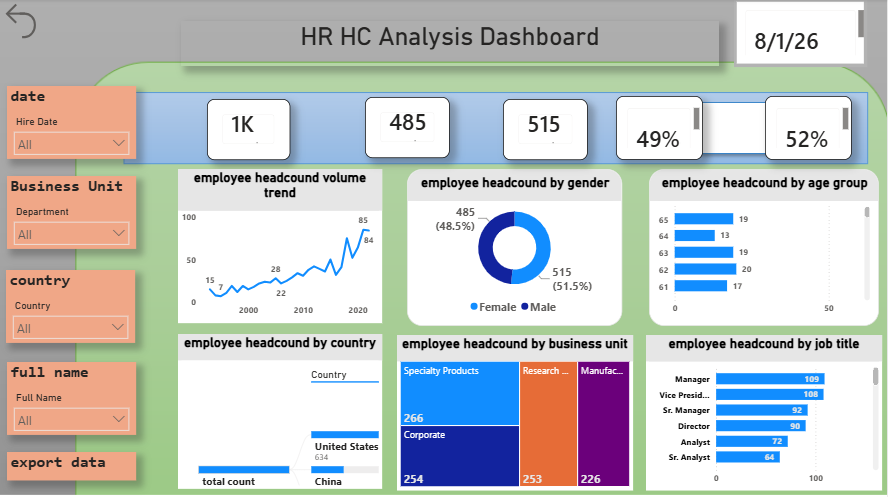
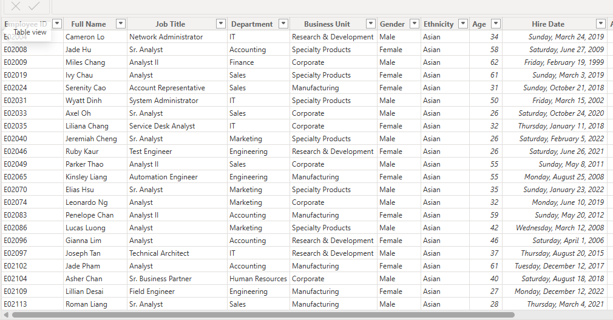
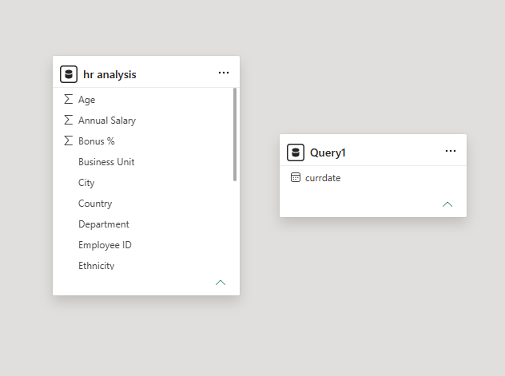

# HR-dashboard-using-powerBI
# 📊 HR Analysis Dashboard

An interactive **HR Analysis Dashboard** designed to analyze employee data and provide meaningful insights into workforce demographics, business units, departments, job roles, gender distribution, and employee headcount trends.

---

## 🖼️ Dashboard Preview

### 📌 HR Dashboard Overview



### 📌 HR Analysis Dashboard


### 📌 Data Source



### 📌 Data Model



---

## 📖 About the Project

The **HR Analysis Dashboard** is a data analytics project that transforms employee data into an interactive dashboard.

The dashboard helps HR teams and decision-makers understand:

- 👥 Total employee headcount
- ⚥ Gender distribution
- 🎂 Employee age groups
- 🌍 Employee distribution by country
- 🏢 Business unit distribution
- 💼 Employee distribution by job title
- 📈 Employee headcount trends
- 🏬 Department-wise employee analysis

The dashboard is designed to make HR data easier to understand through interactive visualizations and filters.

---

## 🛠️ Tools & Technologies

| Tool | Purpose |
|------|---------|
| 📊 Power BI | Dashboard & Data Visualization |
| 📗 Excel | Data Source |
| 🔄 Power Query | Data Cleaning & Transformation |
| 📐 DAX | Calculations & Measures |
| 🗃️ Data Modeling | Relationship & Data Organization |

---

## 📂 Dataset

The dataset contains employee-related information such as:

- Employee ID
- Full Name
- Job Title
- Department
- Business Unit
- Gender
- Ethnicity
- Age
- Hire Date
- Country
- City
- Annual Salary
- Bonus %

---

## 📊 Dashboard Features

### 1. 👥 Employee Headcount

Displays the overall number of employees in the organization.

### 2. ⚥ Gender Analysis

A donut chart provides a quick comparison of male and female employees.

### 3. 📈 Headcount Trend

A line chart shows how employee headcount has changed over time.

### 4. 🌍 Country Analysis

Visualizes employee distribution across different countries.

### 5. 🏢 Business Unit Analysis

Shows the number of employees working in different business units.

### 6. 💼 Job Title Analysis

Ranks job titles based on employee headcount.

### 7. 🎂 Age Group Analysis

Provides insights into employee distribution across different age groups.

---

## 🎛️ Interactive Filters

The dashboard includes interactive filters/slicers for:

- 📅 Hire Date
- 🏢 Department
- 🌍 Country
- 👤 Full Name
- 🏬 Business Unit

Users can select different values to dynamically explore the HR data.

---

## 🔑 Key KPIs

The dashboard provides important HR metrics including:

- **Total Employees:** 1K+
- **Female Employees:** 485
- **Male Employees:** 515
- **Female Percentage:** 49%
- **Male Percentage:** 52%

> KPI values may change depending on the filters selected in the dashboard.

---

## 📌 Key Insights

Some of the insights available from the dashboard include:

- The organization has more than **1,000 employees**.
- Male employees represent a slightly larger proportion of the workforce.
- Employee headcount can be analyzed over time using the trend visualization.
- Business units such as **Specialty Products, Corporate, Research & Development, and Manufacturing** have significant employee populations.
- Job titles such as **Manager, Vice President, Sr. Manager, Director, Analyst, and Sr. Analyst** contribute significantly to employee headcount.
- Country-level analysis helps identify where employees are distributed geographically.

---

## 🔄 Data Analysis Workflow

```text
Excel Dataset
      ↓
Data Cleaning
      ↓
Power Query
      ↓
Data Transformation
      ↓
Data Modeling
      ↓
DAX Calculations
      ↓
Interactive Visualizations
      ↓
HR Analysis Dashboard
